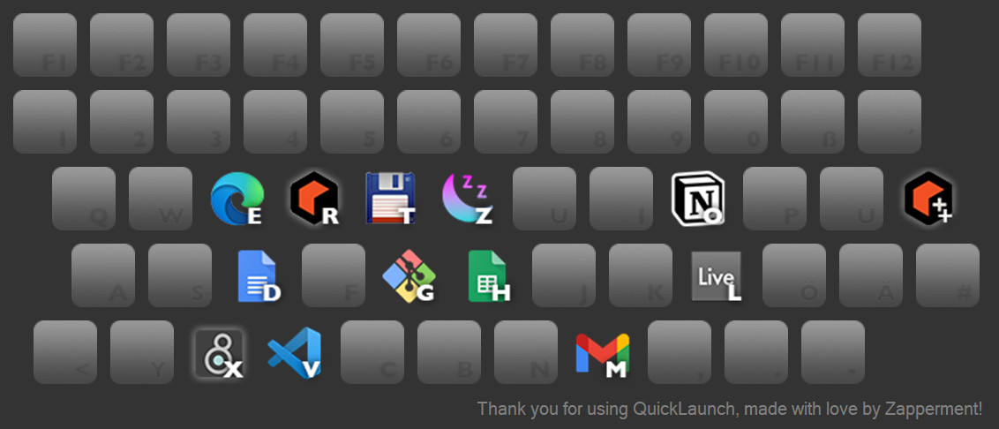

# QuickLaunch

AutoHotkey script that displays a menu to launch Windows apps, in the style of a virtual on-screen keyboard.

## Acknowledgements

Uses [ImageButton](https://github.com/AHK-just-me/Class_ImageButton) 
([Unilicense](https://github.com/AHK-just-me/Class_ImageButton/blob/master/LICENSE)) 